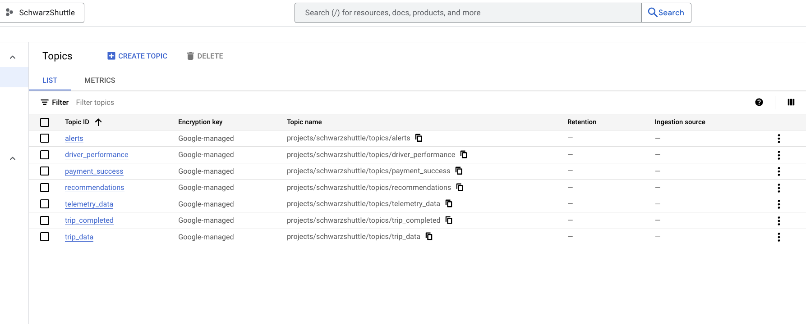
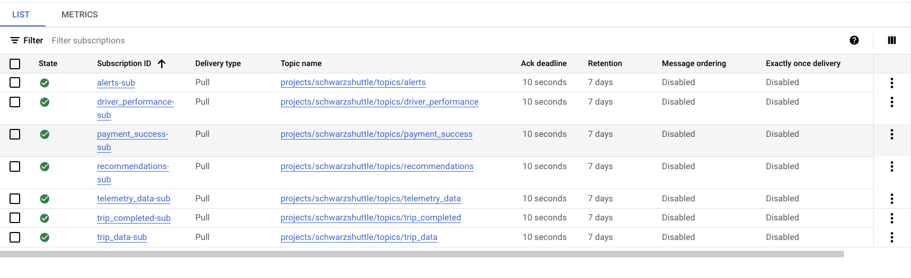
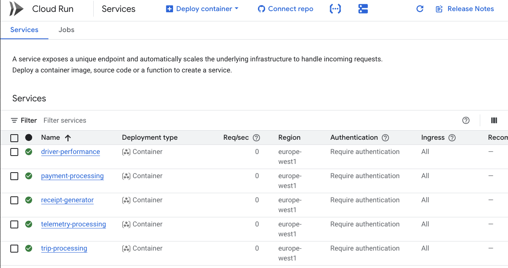
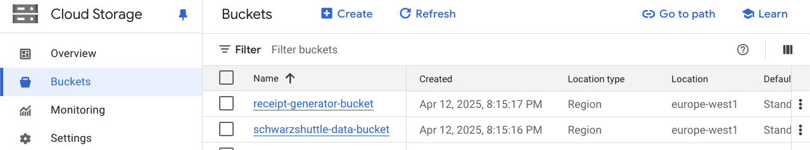
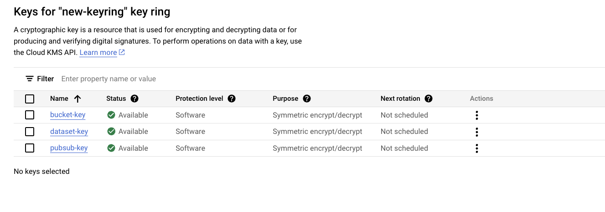

# SchwarzShuttle: City Taxi Business Deployment on Google Cloud Platform

## Overview
SchwarzShuttle is a city taxi business application deployed on Google Cloud Platform (GCP), designed to manage trip revenue, optimize fleet operations, prevent fraud, provide executive dashboards, and analyze operational efficiency. The system leverages various GCP services to ingest, process, and analyze real-time trip and telemetry data, ensuring secure and efficient operations.

## Deployment Options

### 1. Terraform Deployment (Recommended) : 
   For a more comprehensive and production-ready approach, I recommend leveraging the [Terraform Repository](https://github.com/SchwarzShuttle/Infrastructure-Terraform).
   The Terraform configuration provides:
   - Complete infrastructure defined in `vars.yaml` including Core Infrastructure, Data Services, Security, and Compute Services 
   - Network configuration with VPC, private/public subnets, and NAT Gateway 
   - All Pub/Sub topics for trip lifecycle, payments, telemetry, analytics, and operations 
   - Cloud Run services for trip processing, payment processing, driver performance, telemetry, and receipt generation 
   - Clear deployment workflow with preview capabilities (`terraform plan`) 
   - Easier infrastructure maintenance through simple configuration updates

### 2. Python Deployment (This Repository) :
   This repository contains a Python script for deploying the SchwarzShuttle infrastructure, which:
   - Automate approximately 70% of the GCP resources required for SchwarzShuttle  
   - Set up core components including Pub/Sub infrastructure, Cloud Run services, BigQuery datasets with CMEK, KMS keys, service accounts, and storage buckets 
   - Provide a straightforward approach for development and testing environments 
   - Require additional manual configuration for ML, Data Analytics, and IoT components after initial deployment

## Key Features
- **Trip Revenue Management:** Ingests real-time trip data, processes fares, generates receipts, and provides revenue metrics via BigQuery and Looker dashboards.
- **Fleet Optimization:** Processes vehicle telemetry data, predicts demand using Vertex AI, and optimizes vehicle placement.
- **Fraud Prevention:** Analyzes trip data for anomalies using Vertex AI, with automated investigation workflows.
- **Executive Dashboards & Analytics:** Offers KPI monitoring and forecasting via Looker, covering revenue, trip statistics, vehicle utilization, and fraud detection.
- **Operational Efficiency:** Tracks vehicle maintenance, fuel consumption, driver behavior, and route optimization effectiveness.

## Architecture
The deployment uses the following GCP services:
- **Pub/Sub:** For real-time messaging of trip and telemetry data.
- **Cloud Run:** For processing trips, generating receipts, driver payment prcessing, and handling fraud alerts.
- **Dataflow:** For streaming telemetry and fraud detection data processing.
- **Vertex AI:** Trains and runs ML models for demand prediction and anomaly detection.
- **BigQuery:** Stores and analyzes trip and telemetry data.
- **Looker:** Provides dashboards for revenue, fleet, and efficiency metrics.
- **Cloud KMS:** Manages Customer-Managed Encryption Keys (CMEK) for data encryption.
- **Cloud Logging:** Exports audit logs to BigQuery for monitoring and compliance.
- **Buckets:** Store the historical logging data or storing the generated trips receipts.
## Security Measures
- **IAM Policies:** Restrict access to BigQuery and Vertex AI resources, ensuring only authorized service accounts and users have necessary permissions.
- **Network Firewall Rules:** Limit ingress and egress traffic to trusted IP ranges, reducing exposure of resources.
- **Service Account Permissions:** Follow the principle of least privilege, granting minimal roles to service accounts.
- **Data Encryption:** Uses CMEK with Cloud KMS for BigQuery, ensuring control over encryption keys.
- **Audit Logging:** Exports Cloud Audit Logs to BigQuery for monitoring and compliance.
  - *Note:* VPC Service Controls setup is skipped as it requires an organization, which is not available for this project. Alternative security measures are implemented to protect resources.

## Prerequisites
- **Google Cloud Project:** A GCP project (e.g., "schwarzshuttle") with billing enabled.
- **Google Cloud SDK:** Download and install the [Google Cloud SDK](https://cloud.google.com/sdk/docs/install) to use `gcloud` commands.
- **Service Account Setup:**
  *Note* Make sure to replace ALL occurences of `<schwarzshuttle>` strings in the below commands with your GCP project ID!!!
  1. **Create the Service Account:**
     ```bash
     gcloud iam service-accounts create taxi-deployer --display-name="taxi-deployer" --description="Service account for deploying SchwarzShuttle infrastructure"  --project=<schwarzshuttle>
     ```
     This creates a service account with the ID `taxi-deployer@schwarzshuttle.iam.gserviceaccount.com`.
  2. **Grant the Owner Role:**
     ```bash
     gcloud projects add-iam-policy-binding <schwarzshuttle> --member="serviceAccount:taxi-deployer@<schwarzshuttle>.iam.gserviceaccount.com" --role="roles/owner"
     ```
     This grants the service account full access to the project, including the ability to enable APIs and manage resources.
  3. **Create and Download the JSON Key:**
     ```bash
     gcloud iam service-accounts keys create <schwarzshuttle>-key-id.json --iam-account=taxi-deployer@<schwarzshuttle>.iam.gserviceaccount.com --project=<schwarzshuttle>
     ```
     This creates the JSON key file `<schwarzshuttle>-key-id.json` in your current directory. Move it to a secure location accessible by your script (e.g., `E:\taxi-gcp-architecture\<schwarzshuttle>-key-id.json`).
  4. **Secure the JSON Key File:**
     Store the JSON key file securely, as it provides full access to your project. Avoid committing it to version control (e.g., add it to `.gitignore`).
     Set file permissions to restrict access (e.g., on Unix: `chmod 600 schwarzshuttle-key-id.json`).
- **Python 3.10:** Ensure Python 3.10 is installed, as the script is compatible with this version.
- **Dependencies:** Install required Python libraries listed in `requirements.txt`.

## Setup Instructions
### Clone the Repository:
```bash
git clone [<repository-url>](https://github.com/SchwarzShuttle/taxi-gcp-architecture.git)
cd taxi-gcp-architecture
```

### Set Up a Virtual Environment:
#### On Unix/Linux/MacOS:
```bash
python -m venv venv
source venv/bin/activate
```

#### On Windows:
```bash
python -m venv venv
venv\Scripts\activate
```

### Install Dependencies:
```bash
pip install -r requirements.txt
```

### Update `deployment.py`:
Open deployment.py and Set the following variables:
```bash
PROJECT_ID = "<schwarzshuttle>"  # Update to your project ID
LOCATION = "global" # Update to your location
SERVICE_ACCOUNT_KEY_PATH = "<schwarzshuttle>-key-id.json"  # Update to your service account key path
ORGANIZATION_ID = ""  # Set to empty string if no organization; VPC Service Controls requires an organization
```

## Usage
Run the deployment script to set up the infrastructure:
```bash
python deployment.py
```

### Post-Run Checks KMS Permissions (if needed)
 If BigQuery dataset creation fails due to KMS permissions, grant the **Cloud KMS CryptoKey Encrypter/Decrypter** role. You can find the project number in the logs!:
 ```bash
 gcloud kms keys add-iam-policy-binding schwarzshuttle-key --keyring=schwarzshuttle-keyring --location=global --project=<PROJECT_ID> --member=serviceAccount:bq-<PROJECT_NUMBER>@bigquery-encryption.iam.gserviceaccount.com --role=roles/cloudkms.cryptoKeyEncrypterDecrypter
```

#### The list of the resourced that will be created by this Script:   

- Create Pub/Sub topics and subscriptions for trip and telemetry data.



- Set up a BigQuery dataset with CMEK for data storage.

- Deploy Cloud Runs for trip processing, receipt generation, Payment processing, Driver Performance, telemtry processing.


- Initialize Vertex AI for ML model training and inference.

- Create 5 Service Accounts, attach them to their respective Cloud Run services, and grant them appropriate access.

- Create Cloud Storage buckets to store historical logs, trip data, and receipts reports.


- Create Keyring and required KMS keys for encrypting the data either in rest or in transit.


